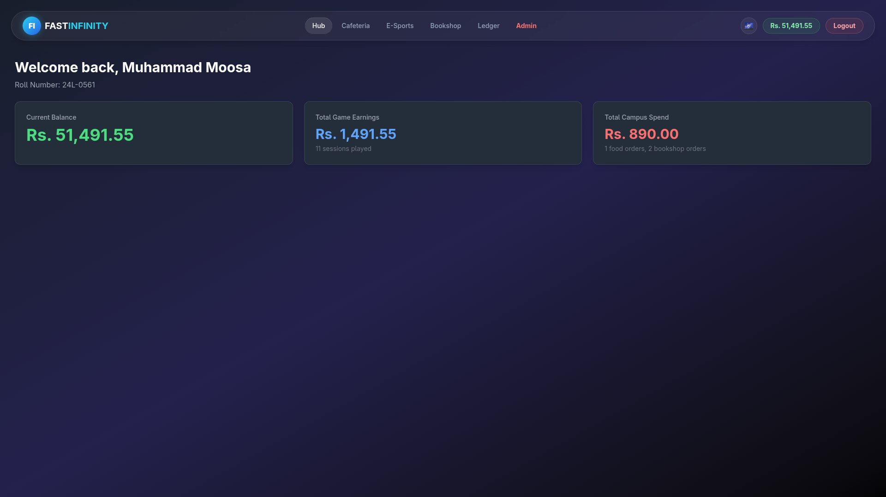
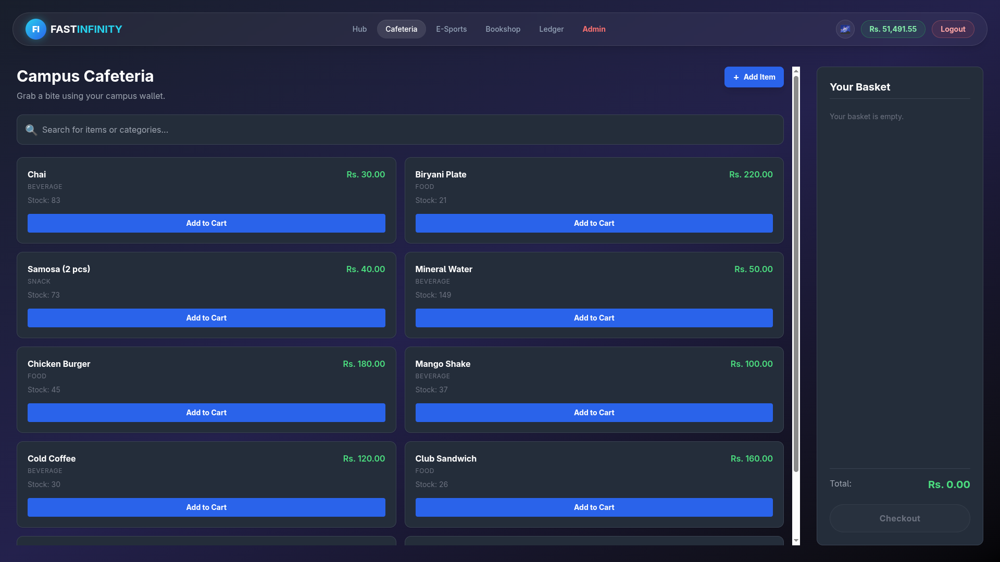
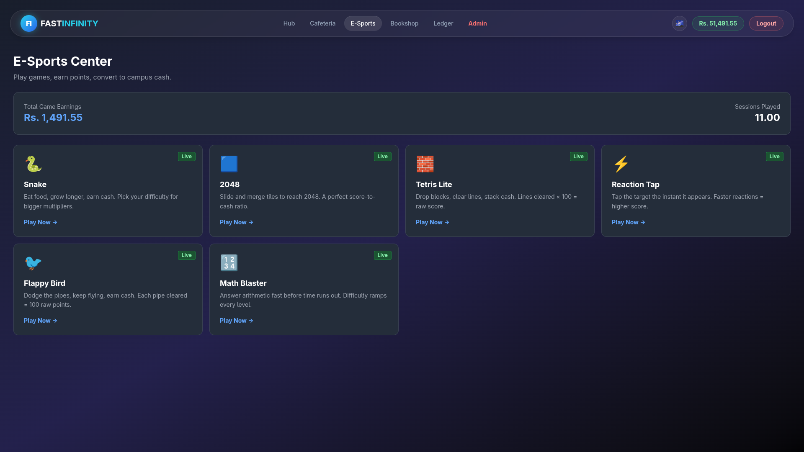
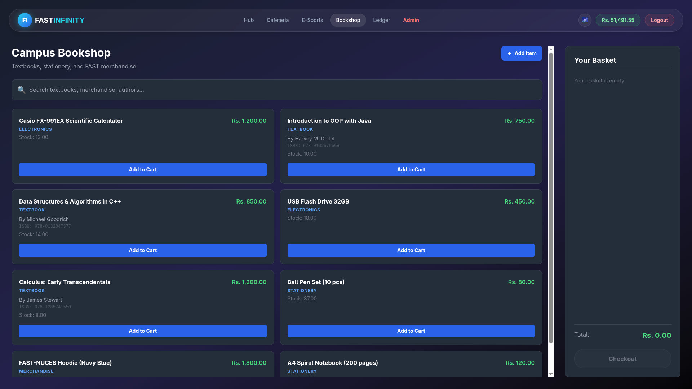
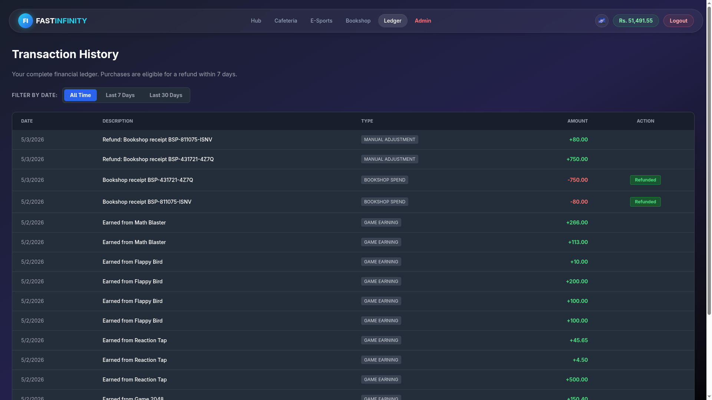
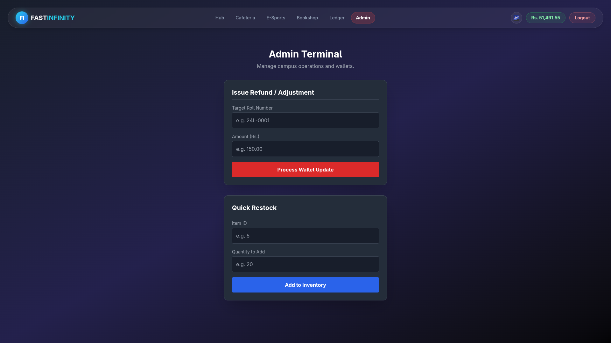

# 🌌 FAST Infinity Campus


**FAST Infinity Campus** is a fully functioning, closed-loop economic simulation and student management portal. Designed with a premium, glassmorphic UI inspired by modern Dribbble and Figma concepts, it features a live virtual wallet, fully operational digital storefronts, an active E-Sports arcade, and a strict ACID-compliant PostgreSQL backbone.

---

## ✨ Features

### 🎨 Next-Gen UI/UX Revamp
The entire frontend has been meticulously designed using modern UI/UX principles sourced from **Figma** and **Dribbble**. It features a deep dark-mode aesthetic, frosted glassmorphism elements, fluid animations, and a highly responsive layout optimized for seamless navigation.








### 🎮 The E-Sports Arcade
Students can earn virtual campus cash by playing actual, fully integrated mini-games. The system logs raw scores, calculates payouts, and updates the global wallet state instantly.

**Playable Titles:**
1. 🐍 **Snake** - The classic arcade survival game.
2. 🧮 **Math Blaster** - Rapid-fire arithmetic challenges.
3. ⚡ **Reaction Tap** - Test your reflex speed.
4. 🧩 **2048** - The addictive sliding tile puzzle.
5. 🧱 **Tetris** - Master the falling blocks.
6. 🐦 **Flappy Bird** - Navigate the treacherous pipes.

> *Security Note:* The arcade is protected by a PostgreSQL trigger (`sp_record_game_session`) that actively monitors for injected/fraudulent scores and rejects abnormal payloads.

### 🍔 Campus Cafeteria & 📚 Bookshop
* **Live Inventory:** Fetches dynamic stock and pricing via optimized database views.
* **Smart Cart System:** Add, remove, and aggregate items in real-time.
* **ACID Checkouts:** Purchases instantly deduct from the user's wallet and decrement database stock using row-level locking to prevent double-spending.
* **Unique Receipts:** Secure generation of unique receipt IDs for tracking.

### 💳 Financial Ledger & Smart Refund System
* **Live Dashboard:** View real-time aggregated metrics (Total Earned vs. Total Spent) powered by mathematically sound database views.
* **Transaction History:** A detailed, filterable ledger (All Time, 7 Days, 30 Days).
* **Self-Service Refunds:** Users can refund their own purchases, strictly enforced by a **7-Day Refund Policy**. The system uses database-level Order IDs to prevent double-refund exploits.

### 🛡️ Admin Terminal
* **Role-Based Access Control (RBAC):** The Admin Terminal is invisible to standard students.
* **Wallet Adjustments:** Admins can manually inject or deduct funds using a student's Roll Number.

### 🔐 Secure Authentication
* Full JWT-based Authentication cycle.
* Encrypted Bcrypt password hashing.
* Login, Registration, and Identity-verified "Forgot Password" resetting.

---

## 🛠️ Tech Stack & Architecture

### Frontend (Client)
* **Framework:** React (via Vite)
* **State Management:** Zustand (Global Wallet State)
* **Routing:** React Router DOM v6
* **Styling:** Tailwind CSS (Custom Glassmorphism configs)
* **API Client:** Axios (with Interceptors for JWT auth)

### Backend (Server)
* **Runtime:** Node.js
* **Framework:** Express.js
* **Security:** JWT (JSON Web Tokens), Bcrypt (Password Hashing), CORS
* **Architecture:** MVC (Controllers, Routes, Middleware)

### Database (PostgreSQL)
The database was engineered with enterprise-level constraints to ensure absolute data integrity.
* **BCNF Normalization:** Zero transitive dependencies or data anomalies.
* **Stored Procedures:** All financial transactions (checkouts, refunds, earnings) bypass standard queries and execute via strict, ACID-compliant stored procedures.
* **Complex Views:** Dashboard metrics and transaction history are aggregated cleanly via pre-compiled SQL views (`vw_student_dashboard`, `vw_wallet_transaction_history`).

---

## 🚀 Getting Started

### Prerequisites
* Node.js (v18+)
* PostgreSQL (v14+)

### 1. Database Setup
1. Create a PostgreSQL database named `fast_infinity_db`.
2. Run the provided `schema.sql` file to build the normalized tables.
3. Run the `stored_procedures.sql` to initialize the ACID logic and triggers.
4. Run the `seed.sql` to populate the initial cafeteria items, bookshop inventory, and game data.

### 2. Backend Setup

```bash
cd backend
npm install
```

Create a `.env` file in the `backend` directory:

```env
PORT=5000
DB_USER=postgres
DB_PASSWORD=your_password
DB_HOST=localhost
DB_PORT=5432
DB_NAME=fast_infinity_db
JWT_SECRET=super_secret_jwt_key
```

Start the server:

```bash
npm start
```

### 3. Frontend Setup

Open a new terminal window (make sure your backend server is still running in the first one) and navigate to the frontend directory:

```bash
cd frontend
npm install
```

(Optional but recommended) Create a `.env` file in the `frontend` directory to explicitly point to your backend:

```env
VITE_API_BASE_URL=http://localhost:5000/api
```

Start the Vite development server:

```bash
npm run dev
```

### 4. Running the Campus

Once both the Node.js backend and the Vite frontend are running successfully:

1. Open your browser and navigate to `http://localhost:5173`.
2. Click **Sign Up** to register a brand new student account.
3. To test the Admin features, register an account with your designated admin Roll Number (e.g., `24L-1234`), navigate to the Admin Terminal, and inject funds into your wallet.
4. Start exploring the shops, playing the arcade games, and testing the economic loop!

---

## 🤝 Development Team

| Role | Contributor |
|------|-------------|
| Frontend Architecture, UI/UX & Arcade Integration | Ahsan Omer |
| Backend API, Auth & Express Middleware | Muhammad Moosa |
| PostgreSQL Architecture, ACID Transactions & Stored Procedures | Eman Jameel |

> Project successfully engineered for the **Database Systems** capstone requirement.
